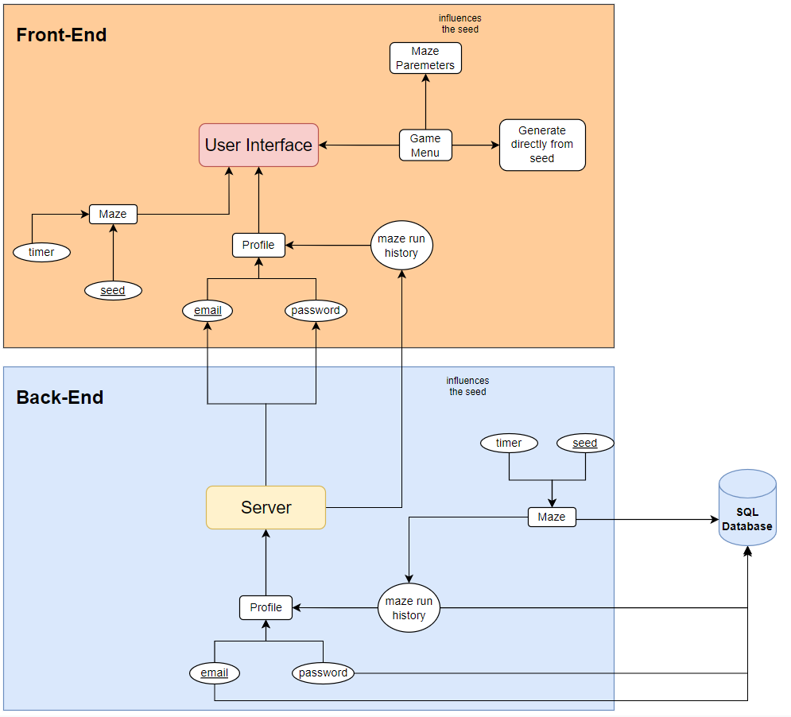

.. _week-5:

Week 5
==============================================

Date: 21/December/2021

Retrospect
------------------------
- First diagram of project is done

  
- Education of Design Patterns is going at a steady pace
- Appropriate diagram software has been found

Week Plan
------------------------
- Finish book about Design Patterns (Will be completed this week along with notes)
- Continue with Research points

Research Points
-----------------
	1. React and browser code integrity in general
	2. Java Spring Beans
